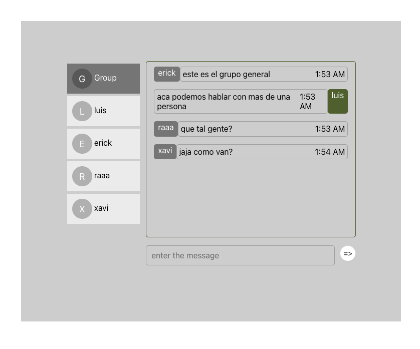

# Demo Spring Boot con Stomp

Se buscó crear un chat room muy similar a la funcionalidad basica de whatsapp
permitiendo a los usuarios chatear en una sala teniendo un usuario y pudiendo
diferenciar entre usuarios dentro del chat grupal, a su vez se añadió un chat grupal
entre usuarios logeados.\
Para las notificaciones push empleamos STOMP, tambien se pudo emplear RabbitMQ pero al ser una demo considere que sera muy tedioso de configurar.

Al ser una demo se añadio una app web sencilla hecha en React para que el usuario
pueda interactuar [link](https://github.com/ericklv/react-front).\

Puntos a tomar en consideración:
- La base del proyecto se genero a traves de Spring Initializr usando Java 17 y Maven
- El projecto usa Lombok, es recomendable usar un IDE capaz de reconocer la sintaxis o con soporte a traves de plugins.
- Se conecta a una base de datos H2 para se almacenar los mensajes de los chats. En caso se desee revisar puede acceder al link [http://localhost:8080/h2-console](http://localhost:8080/h2-console) ,
los accesos para la base de datos se encuentra en el fichero application.properties en la carpeta resources.
- En caso cambiar el puerto en application.properties es necesario actualizar el puerto en la app.

Para ejecutar el proyecto
`mvn spring-boot:run`

URL WEBSOCKET: [http://localhost:8080/ws](http://localhost:8080/ws) .\
URL WEB APP: [http://localhost:3000](http://localhost:3000) .\

